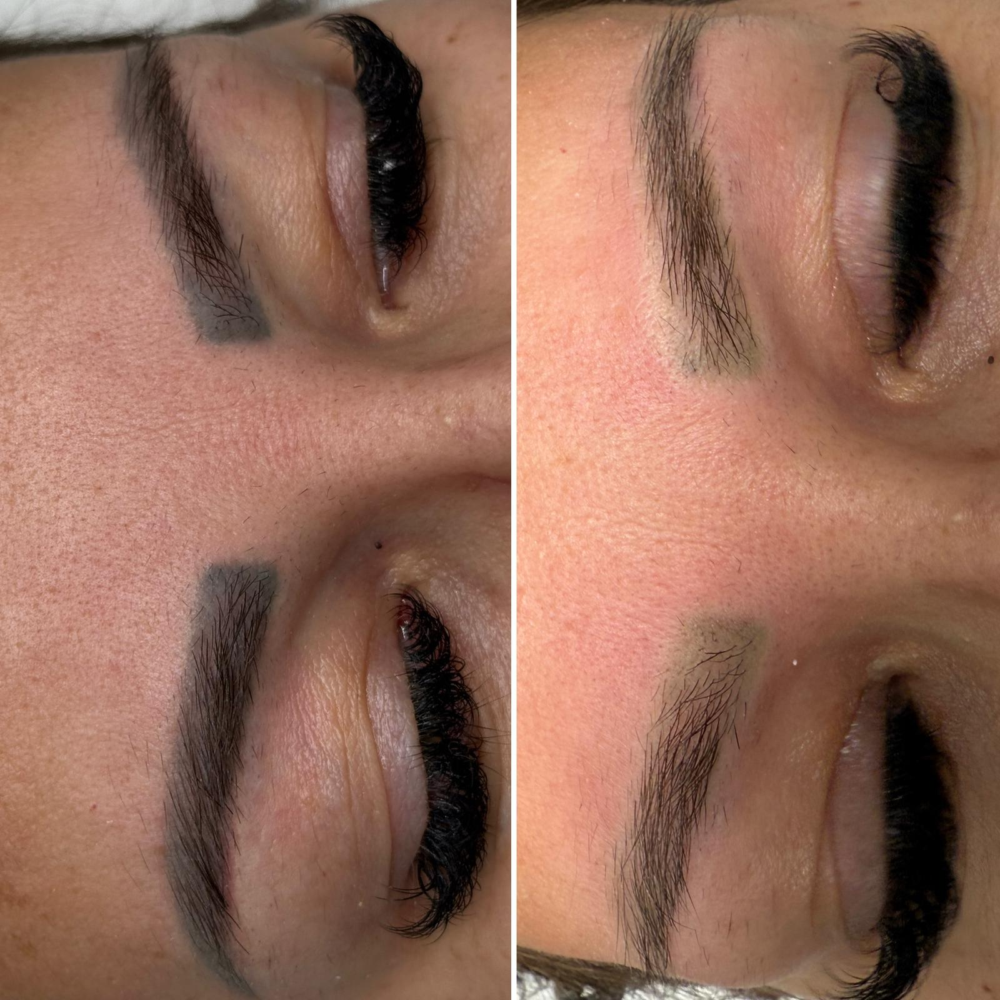
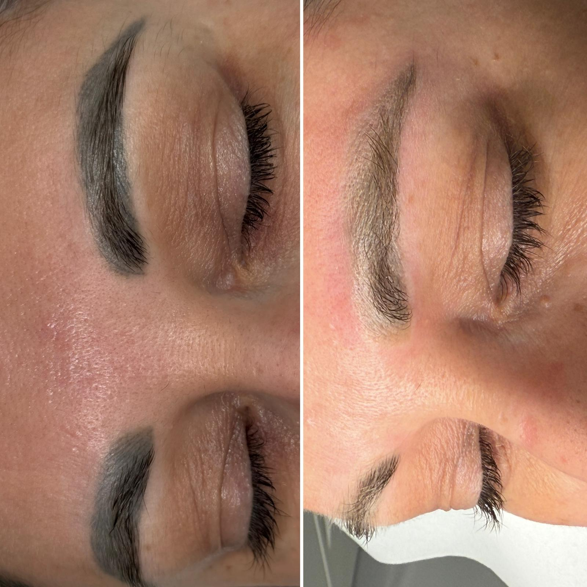

## Indepartare Pigment cu Laser Nd:YAG Q-Switched

Iti doresti sa corectezi o veche micropigmentare, sa estompezi pigmentul nedorit sau sa incepi o noua lucrare?

**Laserul Nd:YAG Q-Switched** este solutia moderna si sigura, creata pentru a elimina treptat pigmentul si a reda pielii un aspect uniform si natural.

## Cum Functioneaza Laserul

Laserul emite impulsuri precise de lumina care descompun pigmentul, iar organismul il elimina treptat in mod natural.

Procedura este delicata si controlata, adaptata fiecarei cliente, pentru rezultate optime si o piele pregatita pentru o noua micropigmentare sau pentru un aspect complet curat si uniform.

## Avantaje Procedurii

**Un mare avantaj**: te poti machia imediat dupa sedinta, fara restrictii, pastrand libertatea de a arata impecabil in orice moment.

## Procesul de Tratament

Numarul de sedinte necesare depinde de:
- Tipul pigmentului
- Intensitatea culorii
- Adancimea implantarii

Fiecare etapa este atent monitorizata pentru a obtine rezultatul dorit: **o piele frumoasa, uniforma si revitalizata**.

## Rezultatul Final

Redescope frumusetea naturala si bucura-te de libertatea de a alege forma si culoarea care te reprezinta!