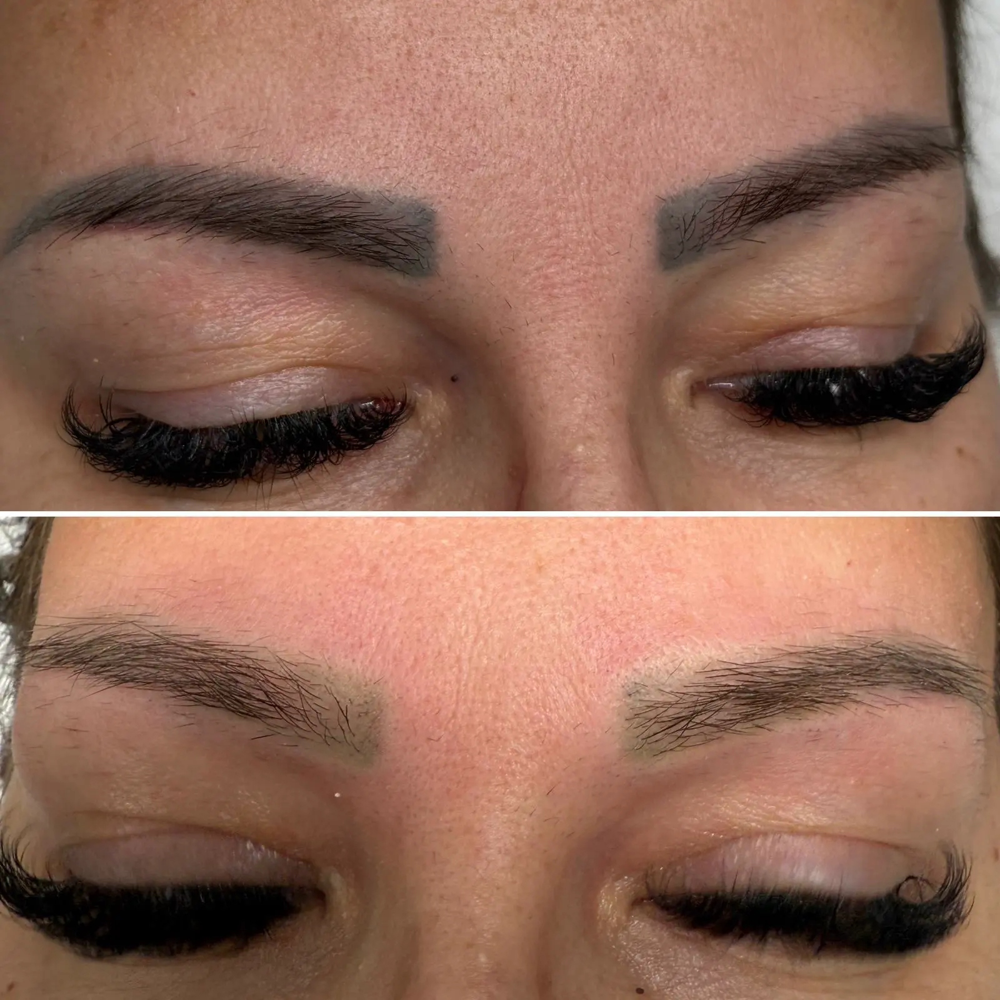
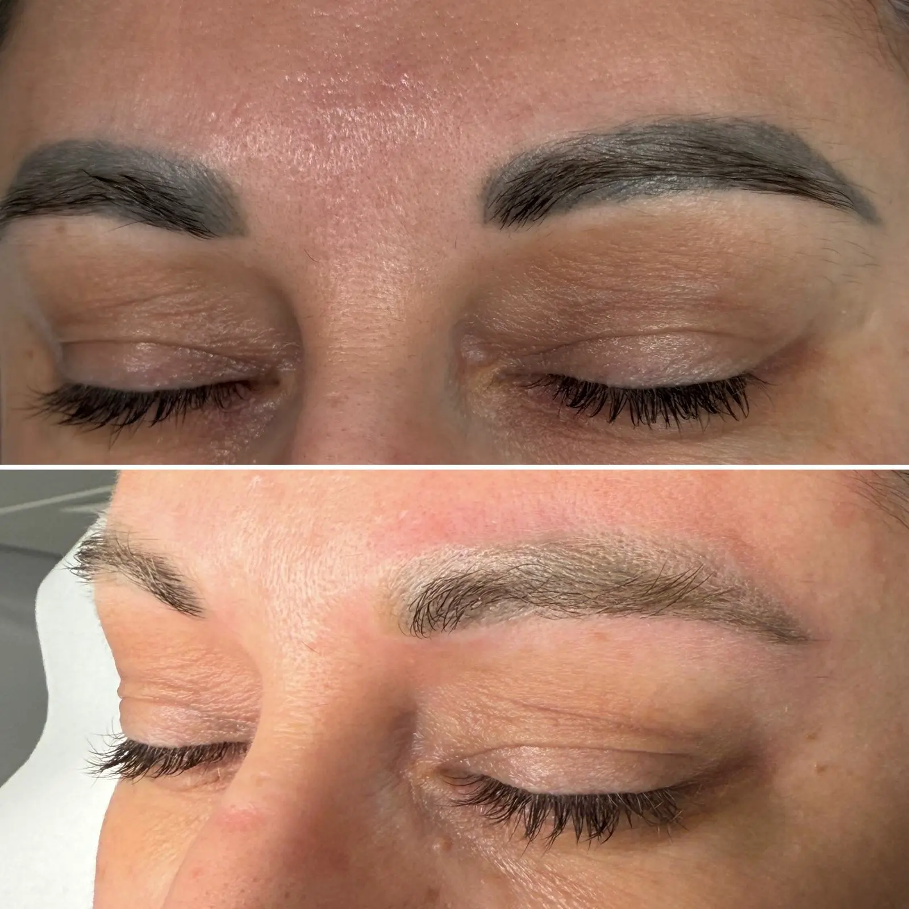

## Indepartare pigment cu laser Ploiesti: ce trebuie sa stii inainte de programare

Indepartare pigment cu laser este procedura minim invaziva prin care eliminam strat cu strat particulele de pigment din piele, fara sa compromitem tesutul sanatos. Inca dinainte de programare iti explicam tehnologia Nd:YAG Q-Switched, cat dureaza fiecare sedinta si ce rezultate reale poti astepta. In randurile urmatoare gasesti ghidul complet despre consultatie, pregatire, sedinte, ingrijire si costuri, astfel incat sa vii in cabinet informata si increzatoare.

Clientii intreaba cel mai des:
- Cate sedinte sunt necesare pentru fiecare nuanta de pigment
- Cat de mult discomfort vei simti si cum se gestioneaza
- Ce reguli de ingrijire trebuie sa respecti intre vizite pentru a accelera recuperarea

## Indepartare pigment cu laser Ploiesti: consultatia initiala si analiza pielii

La prima discutie de indepartare pigment cu laser Ploiesti evaluam istoricul procedurilor estetice si starea actuala a pielii. Analizam daca pigmentul este organic sau anorganic, vechi sau recent, si daca exista cicatrici sau sensibilitati de care trebuie sa tinem cont. Rezultatul evaluarii ne permite sa stabilim un plan realist de sedinte si sa iti oferim o prognoza de timp si buget.

### Ce evaluam la prima intalnire

- Fototipul pielii si modul in care aceasta raspunde la lumina laser
- Profunzimea la care a fost introdus pigmentul si densitatea depozitului colorat
- Zona exacta ce trebuie tratata si particularitatile anatomice

## Etapele sedintei de indepartare pigment cu laser Ploiesti

Fiecare sedinta incepe cu igienizarea zonei si aplicarea unei anestezii topice care amorteste pielea in 15 minute. Folosim un laser Nd:YAG Q-Switched care livreaza impulsuri scurte si controlate, suficient de puternice pentru a fragmenta pigmentul in particule microscopice. Majoritatea clientelor descriu senzatia ca pe o usoara piscatura, comparabila cu un elastic ce loveste pielea.

### Ce se intampla in timpul impulsurilor laser

- Laserul recunoaste culoarea pigmentului si o tinteste selectiv, fara sa afecteze pielea din jur
- Particulele sfaramate sunt preluate de sistemul limfatic si eliminate natural in urmatoarele saptamani

## Cum sa te pregatesti pentru indepartare pigment cu laser Ploiesti

Pregatirea corecta reduce riscul de reactii adverse si creste eficienta procedurii. Evita bronzul artificial si expunerea intensa la soare cu cel putin doua saptamani inainte. Nu aplica acizi puternici sau retinoizi pe zona tratata cu sapte zile inainte, iar in ziua sedintei vino cu pielea curata, fara machiaj sau creme ocluzive. Daca urmezi tratamente medicamentoase, anunta-ne din timp pentru a ajusta planul.

## Recuperare si rezultate dupa indepartare pigment cu laser Ploiesti

In primele 24 de ore vei observa o usoara roseata si o senzatie de caldura locala, semn ca organismul incepe sa elimine pigmentul. Aplicarea de comprese reci si evitarea saunei sau a sportului intens in primele 48 de ore ajuta la o vindecare rapida. In medie, 70% dintre cliente vad o estompare vizibila dupa doua sedinte, iar particulele mai rezistente se atenueaza progresiv in urmatoarele vizite. Intre sedinte lasam un interval de 6-8 saptamani pentru ca tesutul sa se refaca complet.

### Ingrijire la domiciliu

- Curata zona delicat, fara frecare, folosind un produs bland, fara alcool
- Hidrateaza pielea cu o crema recomandata de specialist, de doua ori pe zi
- Foloseste SPF 50 zilnic pentru a preveni hiperpigmentarea post-inflamatorie

## Unde sa faci indepartare pigment cu laser in Ploiesti

Studio-ul nostru este dotat cu laser Nd:YAG Q-Switched calibrat pentru lavori estetice de precizie. Personalul urmeaza protocoale acreditate si actualizate anual, iar fiecare sedinta este documentata fotografic pentru a urmari progresul. Poti vedea rezultate reale in portofoliul nostru si poti discuta cu cliente care au finalizat deja programul de indepartare.

## De ce indepartare pigment cu laser Ploiesti este preferata fata de alte metode

Comparativ cu solutiile saline sau cu dermabraziunea, indepartare pigment cu laser Ploiesti ofera rezultate predictibile si un timp de recuperare mai scurt. Laserul lucreaza selectiv pe pigment, nu pe tesut, ceea ce inseamna un risc minim de cicatrici si o uniformizare rapida a pielii. Pentru pigmentii care contin particule de titan sau oxid de fier adaptam energia fasciculului pentru a preveni intunecarea temporara.

## Intrebari frecvente despre indepartare pigment cu laser Ploiesti

### Cate sedinte sunt necesare

Majoritatea clientelor au nevoie de 3-6 sedinte, in functie de vechimea pigmentului, culoare si adancime. Pigmentii reci, cu subton albastru, raspund mai rapid decat cei calzi, portocalii sau rosii.

### Cat dureaza rezultatele

Odata eliminat, pigmentul nu revine. Daca planuiesti o noua micropigmentare, recomandam sa astepti minimum 45 de zile dupa ultima sedinta pentru ca pielea sa se echilibreze.

## Programeaza o consultatie pentru indepartare pigment cu laser Ploiesti

Daca vrei sa corectezi o micropigmentare veche sau sa pregatesti terenul pentru un nou design, programeaza o consultatie pentru indepartare pigment cu laser Ploiesti. Iti raspundem la toate intrebarile, planificam sedintele si te sprijinim pe tot parcursul tratamentului. Contacteaza-ne telefonic sau prin formularul online si rezerva-ti locul in calendarul urmatoarelor saptamani.
