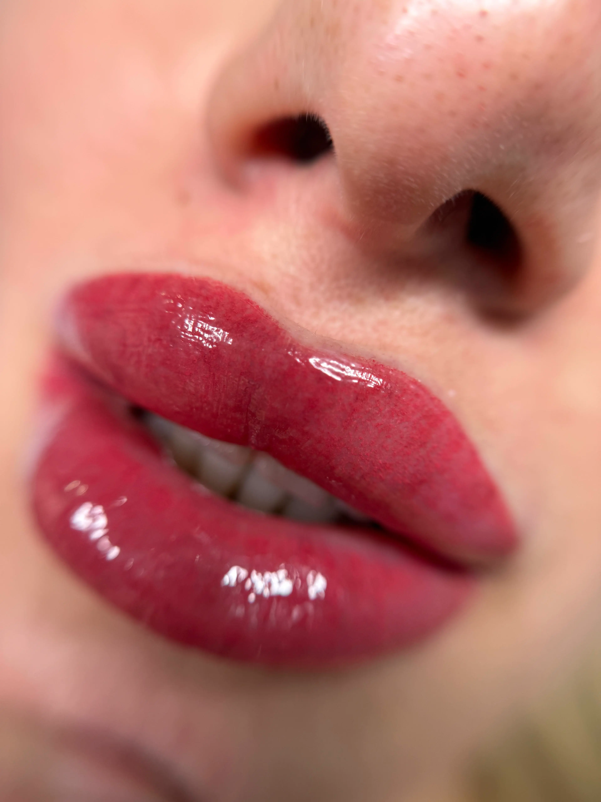
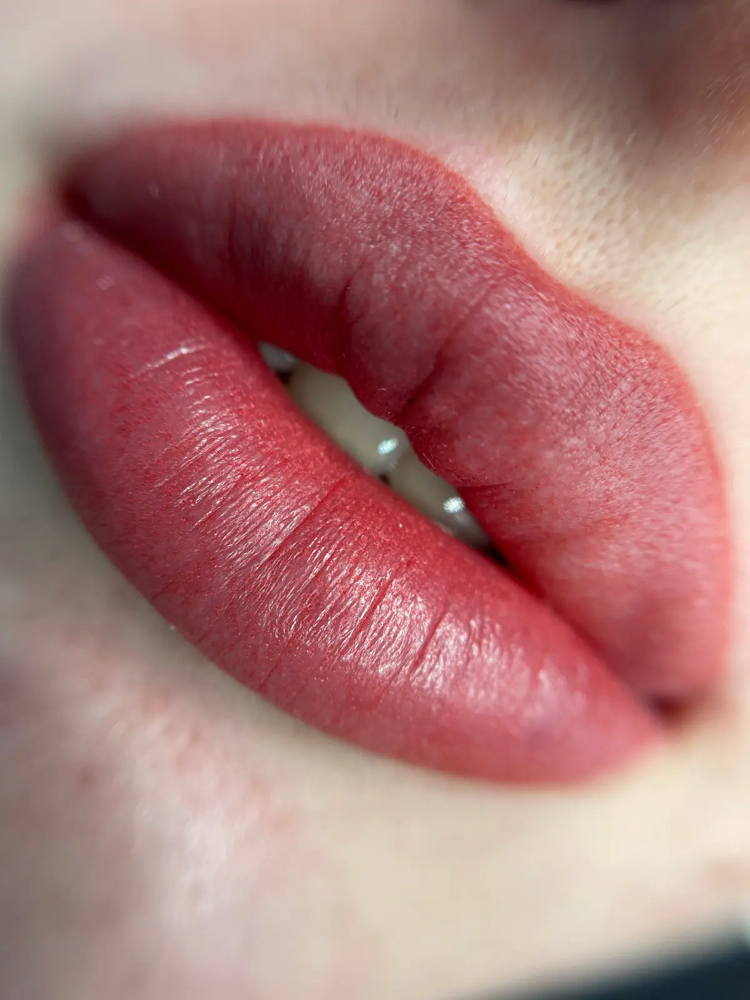

## Micropigmentare buze Ploiesti: tot ce trebuie sa stii inainte de programare

Micropigmentare buze Ploiesti este procedura semi-permanenta prin care reconturam si nuantam buzele pentru un efect natural, fara a depinde zilnic de ruj. In prima discutie iti explicam tehnologia digitala folosita, schema de anestezie si pasii vindecarii, astfel incat sa vii in studio informata si relaxata. Acest ghid include detalii despre consultatie, igienizare, pigmenti, contraindicatii si ingrijire post tratament, pentru ca fiecare decizie sa fie luata in cunostinta de cauza.

Clientii intreaba cel mai des:
- Cat timp dureaza sedinta completa si cate retusuri sunt necesare
- Ce nivel de disconfort simti in timpul implantarii pigmentului
- Cat rezista rezultatul si cum se ingrijesc buzele in perioada de vindecare

## Micropigmentare buze Ploiesti: consultatie si analiza personalizata

Inainte de a scoate aparatul de micropigmentare, realizam o analiza a formei naturale a buzelor, a simetriei fetei si a istoricului tau medical. Evaluam daca exista herpes recurent, sensibilitate la anestezice sau tratamente dermatologice recente. Aceasta evaluare ne permite sa alegem protocolul corect si sa prevenim reactiile adverse.

### Ce stabilim la consultatie

- Forma ideala in raport cu linia nazolabiala si proportiile fetei
- Nuanta pigmentului in functie de tonul pielii si preferintele tale
- Strategia de anestezie topica si timpul necesar pentru a actiona

## Etapele procedurii de micropigmentare buze Ploiesti

Procedura standard dureaza intre 90 si 120 de minute. Dupa igienizare aplicam anestezie topica, apoi schitam conturul pentru aprobarea ta. Folosim un dermograf digital cu ace sterile de unica folosinta care introduc pigmentul in stratul superficial al pielii prin miscari fine, pentru a evita trauma tisulara.

### Ce se intampla in timpul implantarii pigmentului

- Aparatul lucreaza pe frecvente calibrate in functie de grosimea tesutului
- Pigmentii cu baza organica sunt alesi pentru stabilitate si nuante calde
- La jumatatea sedintei reaplicam anestezic pentru confort constant

## Tehnologia si pigmentii folositi

Folosim dermografe certificate CE si pigmenti testati dermatologic, conform reglementarilor europene. Pigmentii sunt hipoalergenici, fara metale grele si asigura o estompare progresiva, nu o decolorare in nuante reci nedorite. Analizam intotdeauna compatibilitatea cu tratamentele faciale curente pentru a evita interactiunile.

## Cum controlam nivelul de disconfort

Majoritatea clientelor descriu senzatia ca pe o vibratie usoara. Aplicam crema anestezica cu lidocaina, iar dupa primele treceri folosim solutii secundare cu benzocaina pentru zonele sensibile. In timpul sedintei facem pauze scurte pentru a evalua confortul si pentru a ajusta presiunea aparatului.

## Pregatirea pentru micropigmentare buze Ploiesti

Cu cinci zile inainte evita exfolierea agresiva, acizii puternici si procedurile cu microneedling in zona buzelor. Hidrateaza intens buzele cu balsam fara parfum si consuma apa suficienta pentru a mentine elasticitatea tesutului. Daca ai antecedente de herpes, medicul dermatolog poate recomanda profilaxie antivirala. In ziua programarii, vino fara ruj si evita cafeaua pentru a mentine circulatia stabila.

## Vindecare si rezultate dupa micropigmentare buze Ploiesti

In primele ore buzele arata mai pline si mai intense cromatic. Crustele subtiri apar in 24 de ore si se desprind natural in 5-7 zile, moment in care culoarea se estompeaza cu aproximativ 40%. Rezultatul final se stabilizeaza la trei saptamani, cand pigmentul se uniformizeaza si stralucirea naturala revine. In studio documentam fiecare etapa cu fotografii pentru a monitoriza progresul. Din monitorizarea interna pe 120 de cliente tratate in 2024, 88% au ajuns la intensitatea dorita dupa retusul de la sase saptamani.

### Ingrijire la domiciliu

- Curata zona doar cu apa plata si tamponare usoara in primele doua zile
- Aplica un balsam recomandat de specialist de trei ori pe zi, fara parfum si petrolatum
- Evita sauna, solarul, piscinele si alimentele foarte fierbinti timp de o saptamana
- Pastreaza un SPF 50 pe buze pentru a preveni oxidarea pigmentului

## Cat rezista micropigmentare buze Ploiesti

Durata medie este de 18-24 de luni, influentata de metabolism, rutina de ingrijire si expunerea la soare. Femeile cu ten uscat observa de obicei o persistenta mai lunga a pigmentului. Recomandam un retus intre lunile 12 si 18 pentru a mentine conturul uniform.

## Intrebari frecvente despre micropigmentare buze Ploiesti

### Cate sedinte sunt necesare

Protocolul include sedinta initiala si un retus dupa 6-8 saptamani pentru a uniformiza tonul. Retusurile ulterioare sunt optionale si depind de preferinta pentru intensitate.

### Ce contraindicatii exista

Nu lucram pe sarcina, alaptare, diabet necontrolat, tratamente cu anticoagulante sau boli autoimune active. Inainte de programare discutam fiecare caz pentru a evalua riscurile.

### Pot combina procedura cu alte tratamente

Da, dar cu intervale de siguranta. Fillerele cu acid hialuronic se pot face la minimum doua saptamani dupa micropigmentare, iar peelingurile chimice dupa o luna.

## Unde faci micropigmentare buze in Ploiesti

Studio-ul nostru din Ploiesti lucreaza pe baza de programare si include protocoale de sterilizare aprobate sanitar. Paula Lupu are peste 7 ani experienta in micropigmentare si participa anual la workshopuri internationale, ceea ce garanteaza tehnici actualizate si rezultate constante.

## Call to action: programeaza micropigmentare buze Ploiesti

Daca vrei buze cu volum subtil si culoare naturala, programeaza o consultatie pentru micropigmentare buze Ploiesti. Scrie-ne pe WhatsApp sau completeaza formularul de contact pentru a primi disponibilitatile si ghidul de pregatire personalizat. Te asteptam in studio pentru a crea forma si nuanta care te reprezinta.
