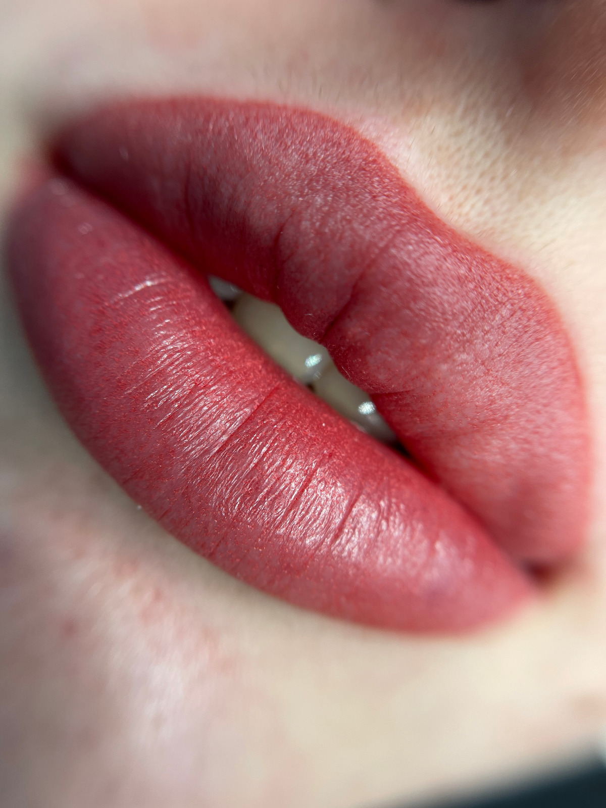
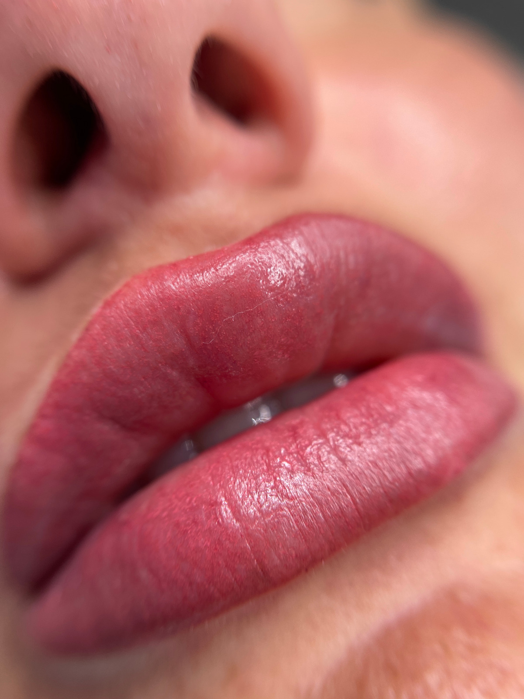

## Micropigmentare Buze - Culoare si Contur Natural

Micropigmentarea buzelor este o procedura estetica avansata, menita sa redea frumusetea naturala a buzelor prin corectarea formei, intensificarea culorii si definirea conturului intr-un mod discret si elegant.

**Scopul tehnicii** este de a obtine buze armonioase, uniforme si luminoase, fara efectul de machiaj accentuat.

## Procesul de Micropigmentare

Procedura consta in introducerea atent dozata a pigmentului in stratul superficial al pielii, folosind miscari fine si controlate.

In functie de dorintele si trasaturile fiecarei cliente, se poate obtine un efect foarte natural sau usor mai intens, insa intotdeauna echilibrat si adaptat fizionomiei.

## Procesul de Vindecare

Imediat dupa procedura, culoarea buzelor apare mai intensa si mai saturata, datorita faptului ca pigmentul este proaspat si pielea reactioneaza printr-o usoara inflamatie.

In timpul procesului de vindecare, care dureaza aproximativ **7-10 zile**, tonul se estompeaza treptat cu **40-50%**, dezvaluind nuanta finala - o culoare naturala, fina si uniforma, perfect integrata cu tonul pielii.

## Rezultatul Final

Rezultatul final ofera **buze catifelate**, bine conturate si vizibil mai luminoase, pastrand un aspect natural si sanatos.

### Beneficii

- Evidentiaza trasaturile
- Corecteaza usor eventualele asimetrii
- Reda prospetimea buzelor
- Creeaza un efect de volum subtil
- Fara modificarea formei naturale