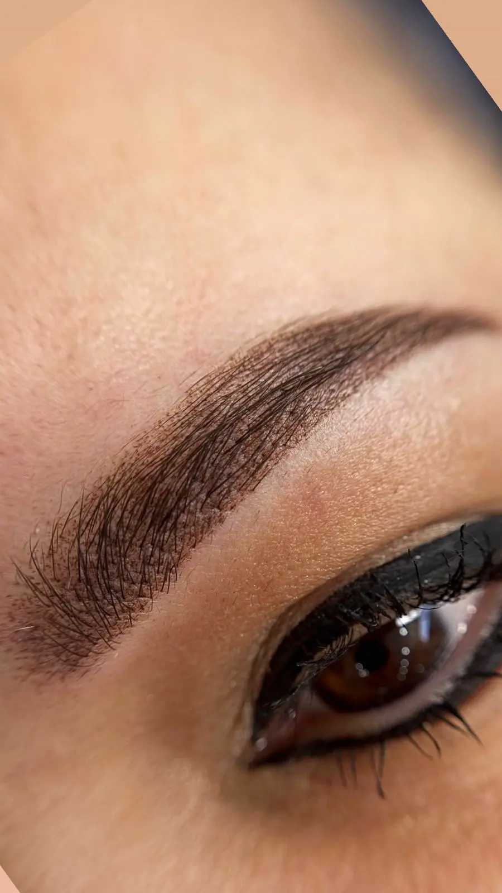
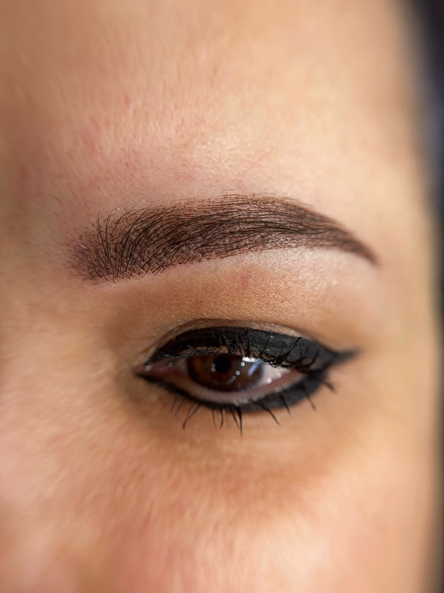

## Micropigmentare sprancene Ploiesti: ce trebuie sa stii inainte de programare

Micropigmentare sprancene Ploiesti este procedura semi-permanenta care redefineste forma si culoarea sprancenelor, oferind un efect pudrat perfect controlat. Inainte de a programa sedinta, iti explicam etapele, contraindicatiile si modul in care calibram aparatul astfel incat sa vii pregatita si increzatoare.

Clientii intreaba cel mai des:
- Cat dureaza sedinta si cate treceri sunt necesare pentru umbrire
- Ce disconfort resimti in timpul lucrarii si cum il gestionam
- Cum trebuie ingrijite sprancenele intre sedinta initiala si retus

## Micropigmentare sprancene Ploiesti: consultatia initiala

Consultatia este momentul in care analizam arhitectura fetei, densitatea firelor si istoricul tau estetic. Verificam daca ai urmat tratamente cu retinoizi, daca exista sensibilitati la anestezice sau proceduri recente care ar impune amanarea.

### Ce evaluam in studio

- Simetria sprancenelor fata de axele fetei si punctele de referinta Golden Ratio
- Tipul de piele (uscata, grasa, mixta) si modul in care retine pigmentul
- Nuanta naturala a parului si preferintele tale privind intensitatea finala

## Etapele procedurii de micropigmentare sprancene Ploiesti

Sedinta standard dureaza 120 de minute si include igienizare, mapping, anestezie si implantare. Folosim un dermograf digital cu ace cartus sterile, calibrate pentru tehnica powder brows.

### Ce se intampla in timpul lucrarii

- Trasam forma cu creion dermatografic si aprobam schita impreuna, astfel incat sa stim exact liniile de umbrire
- Aplicam anestezie topica cu lidocaina, iar dupa primele treceri completam cu benzocaina pentru a mentine confortul
- Realizam umbrirea in straturi subtiri, de la coada spre cap, pentru a obtine gradient natural si contur soft

## Tehnologia si pigmentii folositi

Lucram cu dermograf certificat CE si pigmenti organici, stabilizati pentru a nu vira in tonuri reci. Pigmentii sunt analizati individual pentru fiecare clienta, iar in 2024 am urmarit 160 de lucrari si am observat o mentinere de 92% a tonului initial la retusul de 6 saptamani. Respectam protocoalele de sterilizare la fiecare schimbare de cartus.

## Pregatirea pentru micropigmentare sprancene Ploiesti

Cu 7 zile inainte evita epilarea agresiva, peelingurile chimice si sauna. Hidrateaza zona cu un ser bland si limiteaza consumul de cofeina in ziua sedintei pentru a reduce sensibilitatea. Daca urmezi tratamente medicamentoase, anunta-ne pentru a adapta planul.

## Vindecare si rezultate dupa micropigmentare sprancene Ploiesti

In primele 24 de ore sprancenele par mai inchise cu 30-40% fata de rezultat. Formarea unei pelicule subtiri este normala si se desprinde in 5-7 zile. Pana la retus, pigmentul se stabilizeaza, iar forma devine mai soft. Documentam progresul foto pentru fiecare vizita, astfel incat sa putem ajusta nuanta la retus.

### Ingrijire la domiciliu

- Curata zona doar prin tamponare usoara cu apa plata in primele 3 zile
- Aplica un unguent recomandat de specialist de doua ori pe zi, in strat subtire
- Evita machiajul pe sprancene, sauna, piscina si sauna infrarosu timp de 10 zile
- Foloseste SPF 50 pe frunte pentru a preveni oxidarea pigmentului

## Cat dureaza micropigmentare sprancene Ploiesti

Rezultatul se mentine, in medie, 18-24 luni in functie de metabolism, rutina de skin care si expunerea la soare. Pe pielea uscata pigmentul persista mai mult, iar pe pielea grasa recomandam retus la 12-15 luni. Retusul inclus la 6-8 saptamani permite uniformizarea gradientului si corectarea micro-asimetriilor.

## Intrebari frecvente despre micropigmentare sprancene Ploiesti

### Cat dureaza o sedinta

Sedinta initiala dureaza aproximativ 2 ore, iar retusul 60-75 de minute, in functie de cat pigment trebuie adaugat.

### Ce contraindicatii exista

Nu lucram pe sarcina, alaptare, tratamente cu anticoagulante, boli autoimune active sau dermatoze in zona sprancenelor. Daca ai diabet, solicitam aviz medical.

### Cand se programeaza retusul

Retusul este recomandat la 6-8 saptamani pentru a fixa tonul. Ulterior, mentenanta se face anual sau cand observi estomparea conturului.

## Unde faci micropigmentare sprancene in Ploiesti

Studio-ul nostru foloseste consumabile sterile de unica folosinta si este auditat anual sanitar. Paula Lupu are peste 8 ani experienta in micropigmentare sprancene Ploiesti si participa periodic la perfectionari internationale, ceea ce garanteaza tehnici actualizate si rezultate constante.

## Call to action: programeaza micropigmentare sprancene Ploiesti

Daca vrei sprancene pudrate, bine definite dar naturale, programeaza o consultatie pentru micropigmentare sprancene Ploiesti. Ne poti contacta telefonic sau prin formularul online pentru a primi disponibilitatile si ghidul de pregatire personalizat.
