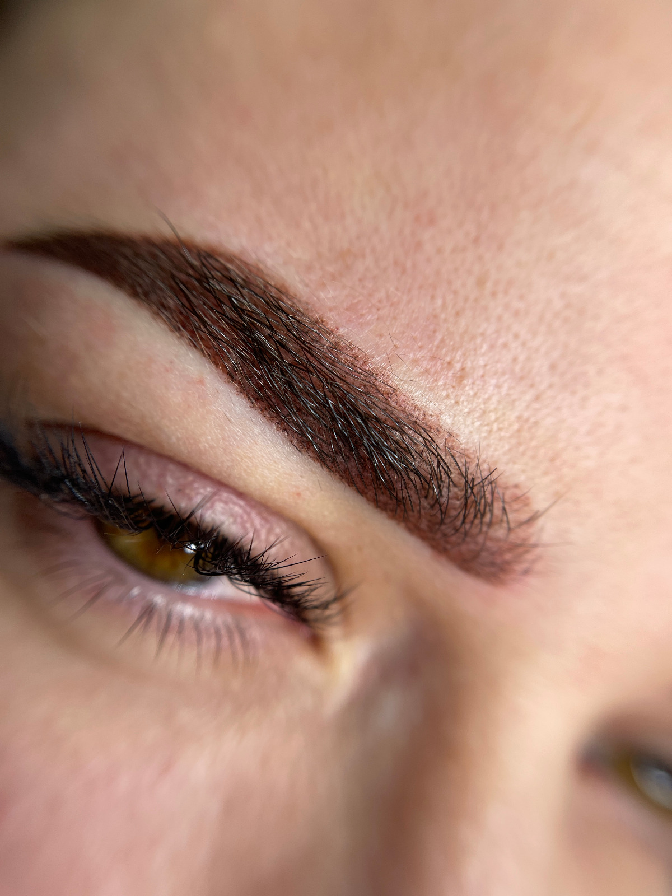

## Micropigmentare Sprancene - Tehnica Pudrata (Powder Brows)

Tehnica pudrata este una dintre cele mai moderne si delicate metode de redefinire a sprancenelor. Aceasta se realizeaza prin implantarea fina a pigmentului in stratul superficial al pielii, cu ajutorul unui aparat de micropigmentare si a unui ac subtire, special conceput pentru lucrari de precizie.

## Cum Functioneaza Tehnica Powder Brows

Spre deosebire de tehnicile clasice, Powder Brows nu implica trasarea de fire, ci creeaza un efect de umbrire difuza, asemanator cu aplicarea unui fard usor sau a unui machiaj profesionist.

Intensitatea si nuanta se adapteaza fiecarui tip de piele, stil de spranceana si preferintelor clientei, de la un aspect foarte natural si aerisit pana la unul mai definit si structurat.

## Procesul de Micropigmentare

In prima etapa, se stabileste forma ideala a sprancenelor printr-o masurare atenta si o schita personalizata in functie de trasaturile fetei.

Urmeaza alegerea pigmentului potrivit, tinand cont de tonul pielii si culoarea parului. Procedura se desfasoara cu anestezie locala topica, pentru un confort sporit.

## Rezultatul Final

**Sprancene perfect conturate**, simetrice si armonioase, cu un efect natural, care pun in valoare expresivitatea chipului.

Rezistenta in timp este, in general, de **1,5-2 ani**, in functie de:
- Tipul de piele
- Stilul de viata
- Ingrijirea post-procedura